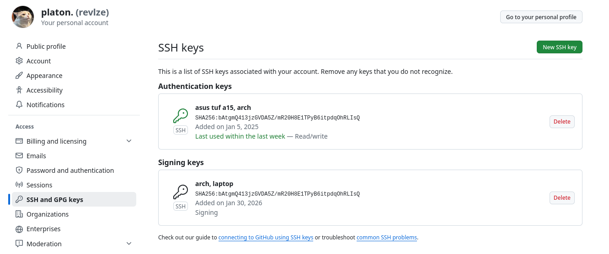

# Signing commits

## Short summary

Подписание коммитов гарантирует, что этот коммит сделал точно истинный автор и его содержимое не было изменено.

## Proofs



```
platon@arch ~> ls .ssh/id_*
.ssh/id_ed25519  .ssh/id_ed25519.pub
```


## Why is commit signing important in DevOps workflows?
1. Подтвеждает личность автора
2. Неизменность коммита
3. Можно настроить пайплайн, чтобы он пропускал только верифицированные коммиты