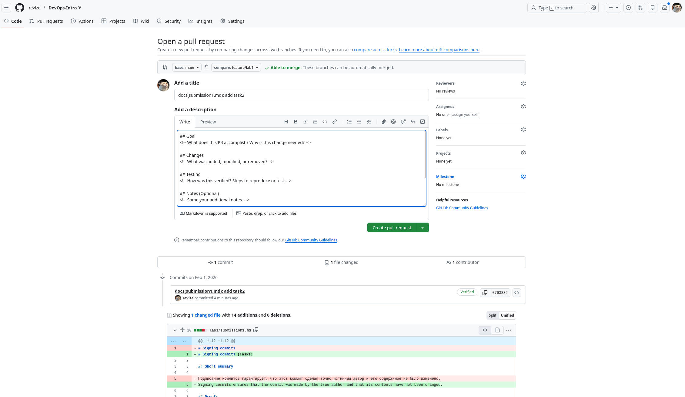
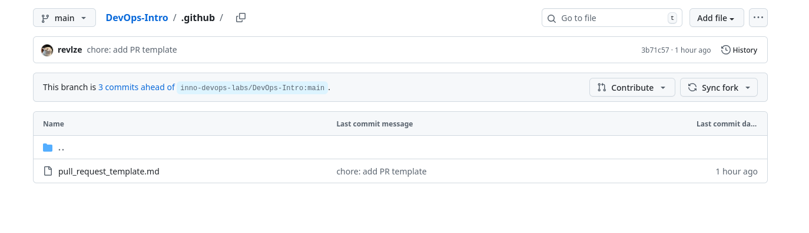

# Signing commits (Task1)

## Short summary

Signing commits ensures that the commit was made by the true author and that its contents have not been changed.

## Proofs


```
platon@arch ~> ls .ssh/id_*
.ssh/id_ed25519  .ssh/id_ed25519.pub
```


## Why is commit signing important in DevOps workflows?
1. Confirms the author's identity
2. Commit immutability
3. Can configure the pipeline to only allow verified commits

---
# PR (Task2)

## Analysis of how PR templates improve collaboration.

Templates help maintain a consistent PR structure so that everyone working on the project can easily analyze any PR, and PR is probably a kind of documentation.
Also, checklists help, typical human errors are corrected even before merging.

## Proofs




